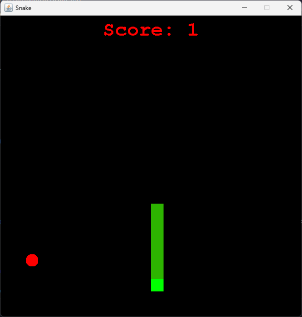
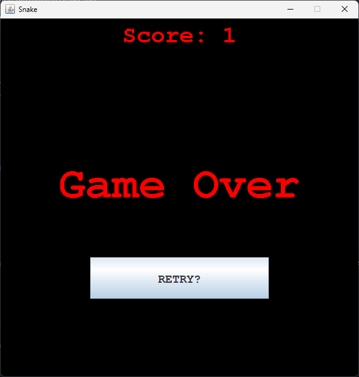

# SnakeGame

Welcome to the Snake Game Tutorial! This project will guide you through creating a classic Snake game using Java. The Snake game is a popular arcade game where the player controls a snake, navigating it to eat food while avoiding collisions with walls or itself.

## Table of Contents

- [Introduction](#introduction)
- [Features](#features)
- [Installation](#installation)
- [Usage](#usage)
- [Game Controls](#game-controls)
- [Project Structure](#project-structure)
- [Screenshots](#screenshots)
- [Contributing](#contributing)
- [Contact](#contact)

## Introduction

This tutorial is designed for beginners who have basic knowledge of Java. By following this tutorial, you will learn how to:

- Set up a Java project
- Use Java Swing for GUI development
- Implement game logic and animations
- Handle user inputs for controlling the snake

## Features

- Classic Snake game mechanics
- Score tracking
- Adjustable game speed
- Simple and clean user interface

## Installation

To set up the project on your local machine, follow these steps:

1. **Clone the repository:**

    ```bash
    git clone https://github.com/ashutoshh-17/SnakeGame.git
    ```

2. **Navigate to the project directory:**

    ```bash
    cd snake-game-tutorial
    ```

3. **Open the project in your preferred IDE (e.g., IntelliJ IDEA, Eclipse):**

    - Import the project as a Maven project if you're using a build tool.
    - Alternatively, you can create a new Java project and add the source files manually.

## Usage

To run the Snake game:

#### Running the Executable JAR File

1. Ensure you have Java Runtime Environment (JRE) installed.
2. Run the JAR file.
   ```sh
   java -jar Snake.jar
   ```   

2. **Run the game:**

    ```bash
    java Main
    ```
    
3. **OR Simply run the Snake.exe file to run the game**    

## Game Controls

- **Arrow Keys:** Control the direction of the snake

## Project Structure

The project structure is as follows:

```
SnakeGame/
├── src/
│   ├── Main.java
│   ├── GamePanel.java
│   ├── SnakeGame.java
│   ├── GameFrame.java
├── README.md
└── Snake.jar & Snake.exe
```

- **Main.java:** The entry point of the game.
- **GamePanel.java:** The main game panel that handles the game loop and rendering.
- **SnakeGame.java:** The Snake class that defines the snake's properties and behaviors.

## Screenshots

### Main Interface



### Game Over



## Contributing

Contributions are welcome! If you have any suggestions or improvements, feel free to submit a pull request. Please make sure your changes do not break the existing code and include a detailed description of the modifications.

## Contact

If you have any questions or feedback, feel free to contact me.

Thank you for following this tutorial! Have fun coding your Snake game!
